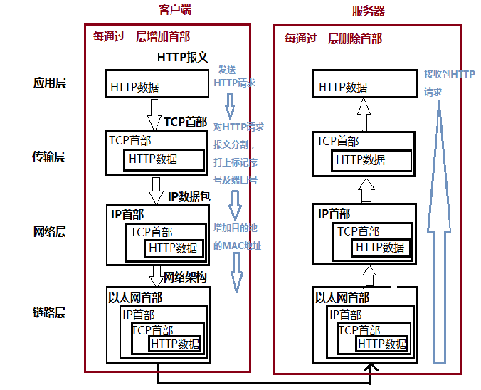

# chapter 1 Web及网络基础
## 1. 概念
1. **客户端（client）**：通过发送请求获取服务器资源的Web浏览器等，都可以称为客户端。
2. Web使用HTTP(HyperText Transfer Protocol,超文本传输协议)完成从客户端到服务端等一系列运作流程，**Web是建立在HTTP协议上通信的**。
3. IP(Internet Protocol网际协议)位于网络层，作用是把各种数据包传送给对方。而要确保传送到对方，则需满足各类条件，其中两个重要的**条件**是：
- IP地址：指明节点被分配到的地址
- MAC地址：指网卡所属的固定地址
#### IP间通信依赖MAC地址，在进行中转时，采用ARP协议（Address Resolution Protocol，地址解析协议，可根据通信方的IP地址反查出对应的MAC地址）凭借MAC地址进行通信。
4. **DNS**(Domain Name System)域名解析提供域名到IP地址之间的解析服务。
5. TCP/IP协议族各层作用：
 - 应用层：应用层决定了向用户提供应用服务时通信的活动。(HTTP、FTP、DNS)
 - 传输层：传输层对上层应用层，提供处于网络连接中的两台计算机之间的数据传输。(TCP和UDP)
 - 网络层：网络层用来处理在网络上流动的数据包。数据包是网络传输的最小数据单位。该层规定了通过怎样的路径到达对方计算机，并把数据包传送给对方。(IP)
 - 链路层：用来处理连接网络的硬件部分。包括控制操作系统、硬件的设备驱动、NIC(网络适配器即网卡)以及光纤等物理可见部分。
 ## 2. TCP/IP通信传输流：
 
 - 客户端在应用层发出一个查看某个Web页面的HTTP请求；
 - 在传输层（TCP协议）把从应用层收到的数据（HTTP请求报文）进行分割，并在各个报文上打上标记序号及端口号后转发给网络层；
 - 在网络层（IP协议），增加作为通信目的地的MAC地址后转发给链路层；至此，发送网络的通信请求就准备好了
 - 接收端的服务器在链路层接收到数据，按序往上层发送，一直到应用层。当传输到应用层，才算真正接收到由客户端发送过来的HTTP请求。
 - 发送端在层与层之间传输数据时，每经过一层时必定会被打上一个该层所属的首部信息；反之，接收端在层与层传输数据时，每经过一层时会把对应的首部消去。

 